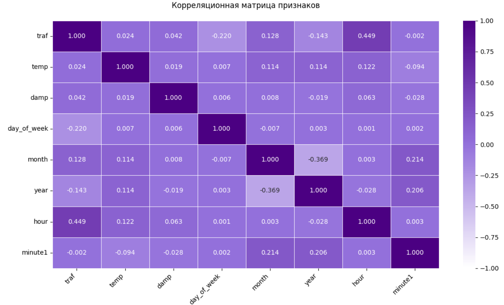

# Moscow Traffic Predictor: Исследование Ансамблевых Моделей

<p align="center">
  
  
  
  
  
</p>

Это не просто курсовая работа, а глубокое эмпирическое исследование эффективности 21 модели машинного обучения для решения задачи регрессии на реальных данных о дорожном трафике в Москве. 

**Цель проекта:** найти оптимальный метод для предсказания загруженности дорог, сравнив производительность, скорость обучения и устойчивость различных моделей — от простых линейных до сложных ансамблей и нейронных сетей.

## О проекте

Мы взяли реальный датасет о транспортной ситуации в районе ВДНХ за 2013-2015 годы и провели полный цикл анализа: от предобработки и разведочного анализа (EDA) до построения, оценки и тонкой настройки моделей.

###  Ключевые особенности
*   **Сравнение 21 модели:** Проведено исчерпывающее сравнение моделей из разных семейств.
*   **Глубокий EDA:** Выявлены скрытые зависимости и сезонность в данных о трафике.
*   **Теоретический обзор:** Дано краткое, но емкое объяснение принципов работы бэггинга, бустинга и стекинга.
*   **Оптимизация гиперпараметров:** Использована библиотека `Optuna` для поиска лучших параметров для LightGBM.
*   **Сравнение с нейросетями:** Ансамблевые методы сравниваются с LSTM-нейросетью, чтобы оценить их эффективность на табличных данных.

##  Данные

Датасет содержит почасовые данные о трафике и погодных условиях.
*   **Целевая переменная (`traf`):** Загруженность дорог по 10-балльной шкале.
*   **Признаки:**
    *   Временные: `год`, `месяц`, `день недели`, `час`, `минута`.
    *   Погодные: `temp` (температура в °C), `damp` (влажность).

## Методология исследования

Проект был разбит на несколько логических этапов:

1.  **Предобработка и инжиниринг признаков:** Извлечение циклических признаков из даты и времени.
2.  **Разведочный анализ данных (EDA):** Визуализация распределений, корреляций и зависимостей для выявления паттернов.
    *Например, корреляционная матрица показала отсутствие сильных линейных связей, что сразу намекнуло на необходимость использования нелинейных моделей.*
    <p align="center">
      
    </p>
3.  **Обучение базовых моделей:** Тестирование "слабых" учеников (линейные модели, решающее дерево, KNN) для получения отправной точки.
4.  **Бэггинговые модели:** Построение RandomForest, ExtraTrees и BaggingRegressor.
5.  **Бустинговые модели:** Глубокое исследование `LightGBM`, `XGBoost`, `CatBoost` и других.
6.  **Тонкая настройка:** Оптимизация гиперпараметров лучшей модели (LightGBM) с помощью `Optuna`.
7.  **Стекинг:** Комбинирование лучших моделей для создания еще более мощного ансамбля.
8.  **Сравнение с нейросетью:** Построение простой RNN (LSTM) для оценки эффективности deep learning на данной задаче.
9.  **Итоговые выводы:** Формулировка рекомендаций на основе полученных результатов.

##  Результаты и выводы

После масштабного сравнения мы получили четкую картину эффективности различных подходов. Вот сводная таблица результатов (RMSE - Root Mean Squared Error, R² - коэффициент детерминации):

| Группа моделей                       | Лучшая модель (в группе)   | R² (Тест) | RMSE (Тест) | Время обучения | Краткий вывод                                                                                                 |
| -------------------------------------- | -------------------------- | --------- | ----------- | -------------- | ------------------------------------------------------------------------------------------------------------- |
| **Базовые и Линейные**                 | KNN (с нормализацией)      | ~0.718    | ~1.30       | < 1 сек        | Крайне низкое качество. KNN требует масштабирования данных.                                                   |
| **Бэггинг**                            | Extra Trees / Random Forest| ~0.738    | ~1.25       | ~10 сек        | Значительное улучшение по сравнению с базовыми, но все еще недостаточно точны.                                |
| **Бустинг (без настройки)**            | LightGBM                   | ~0.829    | ~1.01       | ~0.8 сек       | **Резкий скачок качества.** LightGBM показал себя как самый быстрый и точный из коробки.                       |
| **Стекинг**                            | Stacking (Boostings)       | ~0.824    | ~1.02       | ~56 сек        | Высокое качество, но не превосходит LightGBM. Значительно дольше обучается.                                  |
| **Нейронная сеть**                     | RNN (LSTM)                 | ~0.787    | ~1.13       | ~69 сек        | Уступает градиентным бустингам как по точности, так и по времени на табличных данных.                          |
| ** ЛУЧШАЯ МОДЕЛЬ **                  | **LightGBM (с Optuna)**    | **~0.835**| **~0.997**  | ~60 сек (вкл. поиск) | **Победитель!** Тонкая настройка позволила достичь наилучшего баланса точности и производительности. |

<p align="center">
  
</p>

**Итоговый вывод:** Для данной задачи регрессии на табличных данных **оптимизированный LightGBM** является абсолютным победителем. Он минимизирует ошибку (в среднем «промах» < 1 балла по 10-балльной шкале), объясняет ~83.5% дисперсии данных и превосходит как более простые ансамбли, так и сложные подходы вроде стекинга и нейронных сетей.

##  Возможности для дальнейшего развития

Хотя текущее исследование является исчерпывающим, есть несколько интересных направлений для развития проекта:

*   **Расширение данных и признаков:**
    *   **Больше данных:** Использовать более свежие данные (после 2015 года), чтобы учесть изменения в дорожной инфраструктуре Москвы.
    *   **Гео-признаки:** Добавить информацию о близости к станциям метро, крупным перекресткам, торговым центрам.
    *   **Событийные признаки:** Включить данные о государственных праздниках, крупных городских мероприятиях (фестивали, концерты), которые сильно влияют на трафик.
    *   **Лаговые признаки:** Добавить значения трафика и погоды за предыдущие часы/дни (например, трафик час назад, 24 часа назад) для лучшего улавливания временных зависимостей.

*   **Углубленное моделирование:**
    *   **Продвинутый стекинг:** Построить многоуровневый стекинг (2+ уровня), возможно, с разными мета-моделями.
    *   **Интерпретируемость:** Применить SHAP или LIME к лучшей модели (LightGBM), чтобы понять вклад каждого признака и объяснить "черный ящик".
    *   **Альтернативные модели:** Протестировать новейшие модели для табличных данных, такие как TabNet или TabPFN.

*   **Внедрение и MLOps:**
    *   **API-сервис:** Обернуть лучшую модель в API с помощью FastAPI для получения предсказаний в реальном времени.
    *   **Интерактивный дашборд:** Создать простой веб-интерфейс на Streamlit или Dash, где можно было бы вводить параметры (время, погода) и получать прогноз загруженности.
    *   **Докеризация:** Упаковать приложение в Docker-контейнер для легкого развертывания на любом сервере.

## 🛠️ Как запустить проект

1.  Клонируйте репозиторий:
    ```sh
    git clone https://github.com/YOUR_USERNAME/moscow-traffic-predictor.git
    cd moscow-traffic-predictor
    ```

2.  Создайте и активируйте виртуальное окружение (рекомендуется):
    ```sh
    python -m venv venv
    source venv/bin/activate  # Для Windows: venv\Scripts\activate
    ```

3.  Установите все необходимые зависимости (предварительно создайте файл `requirements.txt`):
    ```sh
    pip install -r requirements.txt
    ```
    *Основные библиотеки: `pandas`, `numpy`, `scikit-learn`, `matplotlib`, `seaborn`, `lightgbm`, `xgboost`, `catboost`, `optuna`, `torch`.*

4.  Откройте и запустите Jupyter Notebook `course_project.ipynb`.

##  Технологический стек

*   **Анализ данных:** Pandas, NumPy
*   **Визуализация:** Matplotlib, Seaborn
*   **Машинное обучение:** Scikit-learn, LightGBM, XGBoost, CatBoost
*   **Оптимизация:** Optuna
*   **Глубокое обучение:** PyTorch

## 📄 Лицензия

Этот проект распространяется под лицензией MIT. Подробности см. в файле `LICENSE`.
